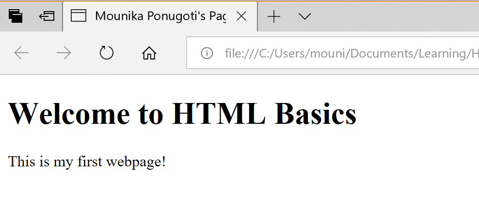

# Getting Started
This file describes the HTML basics briefly.

## Editor
We can use any *text editor*, notepad++ for example, to creat as well as edit the HTML files. 
HTML files are required to save with `.html` extension. <\br>

## Syntax
To compliant with the HTML standard, HTML document starts with a tag `<!DOCTYPE html>` to let the browser know that 
it is a HTML document. </br>

All the text on a webpage is described with the help of HTML elements. </br>

An opening HTML tag is used to start HTML elements by wrapping opening `<` and closing angle `>` bracket around it. Similarly, closing 
tag is the second HTML tag used to end the HTML element which includes florward slash `/` along with `<`, `HTML element`, and `>`.
Actual content is included within the opening tag and closing tag and formatting of the content depends on the type of tag.

#### General format of HTML elements
```
<tagName> Content goes here </tagName>
```
#### Basic tags
+	`<html>:` All the HTML code must be enclosed within the basic HTML tags `<html>` (beginning tag) and `</html>` (end tag)
+	`<head>:` Head tag includes all the header information of the web page such as title and other miscellaneous information.
This info should be enclosed with in the tags `<head>` and `</head>`
+	`<title>:` This tag is used to set the title of the web page and it should be enclosed within `<title>` and `</title>`
+	`<body>:` This tag contains the actual body of the page. It starts with `<body>` and ends with `</body>`
+	`<p>:` This is a child of a body or paragraph. Just like other tags, it ends with `</p>`
+	`<h1>:` This tag defines the heading 1. HTML has 6 headings and can be formatted with the tags `<h1>` to `<h6>` and terminated with 
`</h1>` to `</h6>` respectively.
... others will be added soon
</br>

A simple example which includes the title, heading 1, and a paragraph is shown below: (open file basic.html in a browser to see the output)
```html
<!DOCTYPE html>
<html>
	<head>
		<title> Mounika Ponugoti's Page </title>
	</head>

	<body>
		<h1> Welcome to HTML Basics </h1>
		<p>  This is my first webpage! </p>
	</body>
</html>
```

In the sample output, check the name of the webpage and see the output. Understand how the text enclosed within different tags is 
formatted. </br> </br>

